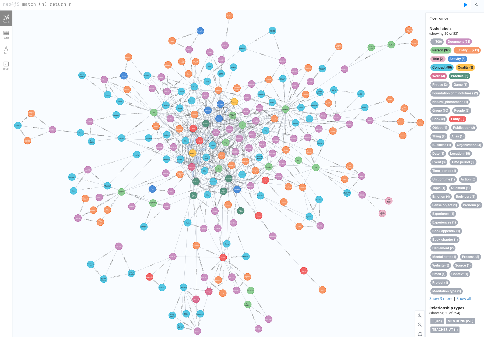

# Extracting some knowledge graph out of Collecting Gold Dust book<!-- omit from toc -->

## Table of contents<!-- omit from toc -->

- [Introduction](#introduction)
- [Running the converter](#running-the-converter)
- [Running the PDF conversion with docker](#running-the-pdf-conversion-with-docker)
- [Running the full data workflow](#running-the-full-data-workflow)
- [Development](#development)

## Introduction

This directory holds a [copy of the pdf version of Sayadaw U Tejaniya's book
COLLECTING GOLD DUST Nurturing the Dhamma in Daily Living](./original_data/2019_-_Sayadaw-U-Tejaniya-Collecting-Gold-Dust-Web-Book-1.pdf) as offered e.g. by [this Scribd link](https://www.scribd.com/document/716383730/Collecting-Gold-Dust-Web-Book-1).



## Running the converter

```bash
cd `git rev-parse --show-toplevel`/Convert
python3.10 -m venv venv
source ./venv/bin/activate
pip install -r requirements.txt
python main.py
```

## Running the PDF conversion with docker

```bash
docker build -tjejuness:doc_Collecting_Gold_Dust https://github.com/EricBoix/jj_doc_Collecting_Gold_Dust.git#:DockerContext
docker run --rm jejuness:doc_Collecting_Gold_Dust --help
```

Extracting the result out of the container requires local filesystem mount

```bash
docker run --rm  -v `pwd`/junk:/output jejuness:doc_Collecting_Gold_Dust --output_directory /output
```

## Running the full data workflow

Note: for a commented version of the following workflow refer e.g. to [the Four Noble Truth workflow](https://github.com/EricBoix/jj_doc_Four_Noble_Truths/blob/main/README.md#running-the-full-default-data-workflow).

Setup and context clean-up

```bash
cd `git rev-parse --show-toplevel`         # Implicit from now on
git clone https://github.com/EricBoix/jj_worflow_shell.git

export RESULTS_DIR=`pwd`/result_data       # Syntactic sugar
\rm -fr result_data/database
```

From original PDF to markdown and JSON

```bash
cd `git rev-parse --show-toplevel`
docker build -tjejuness:doc_Collecting_Gold_Dust https://github.com/EricBoix/jj_doc_Collecting_Gold_Dust.git#:DockerContext
docker run --rm  -v `pwd`/result_data:/output jejuness:doc_Collecting_Gold_Dust --output_directory /output
```

Change the following neo4j database parameter values in order to suit your needs

```bash
export NEO4J_PORT=7687
export NEO4J_USERNAME=neo4j
export NEO4J_PASSWORD=your_password
```

The also adapt the following LLM server designation and credentials

```bash
LLM_MODEL_URL=https://ollama-ui.pagoda.liris.cnrs.fr/ollama/
LLM_API_KEY=sk-xxxxxxxxxxxxxxxxxxxxxxxxxxxxxxx
LLM_MODEL_NAME=llama3:70b
```

Transmitting (by file) servers info to upcoming treatment processes:

```bash
echo "# Neo4j server designation and associated credentials" > .env
echo "NEO4J_URI=bolt://localhost:$NEO4J_PORT"                >> .env
echo "NEO4J_USERNAME=$NEO4J_USERNAME"                        >> .env
echo "NEO4J_PASSWORD=$NEO4J_PASSWORD"                        >> .env
#
echo "### LLM server designation and associate credential" >> .env
echo "MODEL_URL=$LLM_MODEL_URL"                            >> .env
echo "API_KEY=$LLM_API_KEY"                                >> .env
echo "MODEL=$LLM_MODEL_NAME"                               >> .env
```

Prerequisite Knowledge Graph (KG) extraction: launch a neo4j database

```bash
source jj_worflow_shell/Neo4jDatabase.sh    # Implicit from now on
launch_neo4j_db $RESULTS_DIR $NEO4J_PORT $NEO4J_USERNAME/$NEO4J_PASSWORD
```

Run the (Knowledge Graph) extraction

```bash
source jj_worflow_shell/treatments.sh   # Implicit from now on
# Note: the documents are implicitly in <cwd>/original_data sub-directory
extract_knowledge_graph $RESULTS_DIR '--load_markdown_document 2019_-_Sayadaw-U-Tejaniya-Collecting-Gold-Dust-Web-Book-1_-_local_converter.md  --load_json_document 2019_-_Sayadaw-U-Tejaniya-Collecting-Gold-Dust-Web-Book-1_-_Sentences_as_LangChain_Document.json'
```

Dump the database content for later usage (optional)

```bash
dump_database $RESULTS_DIR neo4j.CollectingGoldDust.MarkdownTextSplitterAndSentences.dump
```

In order to validate the dump, erase the database and restore it (out of the
previous dump)...

```bash
# WARNING: this DELETEs the existing database
rm -fr $RESULTS_DIR/database     
restore_database $RESULTS_DIR neo4j.CollectingGoldDust.MarkdownTextSplitterAndSentences.dump
launch_neo4j_db $RESULTS_DIR $NEO4J_PORT $NEO4J_USERNAME/$NEO4J_PASSWORD
```

Extract knowledge graph in [Turtle](https://en.wikipedia.org/wiki/Turtle_(syntax)) format:

```bash
dump_knowledge_graph_in_turtle $RESULTS_DIR CollectingGoldDust.MarkdownTextSplitterAndSentences.ttl
```

Eventually turn the context off:

```bash
stop_neo4j_db
```

## Development

### Testing

Within the above running context (directory and installed virtual environment)

```bash
pip install -r requirements-dev.txt
pytest test_main.py
```

### Updating/overwriting the result_data contents

Once development has improved some resulting converted files the following command will overwrite the reference resulting data

```bash
python main.py --output_directory ../result_data/
```

### Code limitations/errors to be fixed

- Some word get modified during extraction: within `output.md` look for
  - the word `eperience` that was initially properly spelled in the sentence `discussing their experiences and discoveries`.
  - the word `ecitement` that was initially properly spelled in the sentence `excitement calming down`
- Some subchapters (quite a few actually) are erroneous. For example the original text doesn't have chapter named `A CAUSE AND EFFECT CHAIN` or `| |`...
