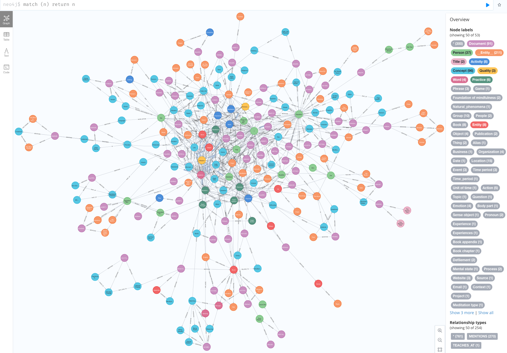

# Collecting Gold Dust book<!-- omit from toc -->

This repository holds code dedicated to extracting some knowledge graph out of the pdf version of Sayadaw U Tejaniya's book [COLLECTING GOLD DUST Nurturing the Dhamma in Daily Living](./original_data/2019_-_Sayadaw-U-Tejaniya-Collecting-Gold-Dust-Web-Book-1.pdf)



## Table of contents<!-- omit from toc -->

- [Notes concerning the original book](#notes-concerning-the-original-book)
- [Running the PDF converter with python](#running-the-pdf-converter-with-python)
- [Running the PDF converter with docker](#running-the-pdf-converter-with-docker)
- [Running the PDF converter with jejune\_cli](#running-the-pdf-converter-with-jejune_cli)
- [Running the data workflow with jejune\_cli](#running-the-data-workflow-with-jejune_cli)
- [Development/Issues](#developmentissues)

## Notes concerning the original book

This directory holds a [copy of the pdf version of Sayadaw U Tejaniya's book
COLLECTING GOLD DUST Nurturing the Dhamma in Daily Living](./original_data/2019_-_Sayadaw-U-Tejaniya-Collecting-Gold-Dust-Web-Book-1.pdf) as offered e.g. by [this Scribd link](https://www.scribd.com/document/716383730/Collecting-Gold-Dust-Web-Book-1).

## Running the PDF converter with python

### Virtual environment set up

```bash {"name":"python-venv-install"}
cd `git rev-parse --show-toplevel`/Convert
python3.10 -m venv venv
source ./venv/bin/activate
pip install -r requirements.txt
python main.py --help
```

### Running the converter

Within the above running context (directory and installed virtual environment)

```bash {"name":"python-venv-run","terminalRows":"5"}
cd `git rev-parse --show-toplevel`/Convert
source ./venv/bin/activate
python main.py
```

and the markdown default output should be placed in `output.md` file.

### Testing the conversion results

```bash {"name":"python-venv-test","terminalRows":"5"}
cd `git rev-parse --show-toplevel`/Convert
source ./venv/bin/activate
pip install -r requirements-dev.txt
python main.py --test
# and with a more verbose output:
pytest -vv test_main.py
```

### Developers: updating/overwriting the result_data contents

Once development has improved the resulting converted file, the following command will overwrite the reference resulting data

```bash {"name":"python-venv-overwrite-reference","terminalRows":"5"}
cd `git rev-parse --show-toplevel`/Convert
source ./venv/bin/activate
python main.py --output_directory ../result_data/
```

## Running the PDF converter with docker

```bash {"name":"docker-build-and-run"}
docker build -t jejuneness:convert_Collecting_Gold_Dust https://github.com/EricBoix/jejune_doc_Collecting_Gold_Dust.git#:DockerContext
docker run --rm jejuneness:convert_Collecting_Gold_Dust --help
```

Running the tests

```bash {"name":"docker-run-test"}
docker run --rm jejune:convert_Collecting_Gold_Dust --test
```

Extracting the result out of the container requires local filesystem mount

```bash {"name":"docker-run-output-extraction","terminalRows":"5"}
docker run --rm  -v `pwd`/junk:/output jejuneness:convert_Collecting_Gold_Dust --output_directory /output
```

and the result will be placed in a newly created `junk/` subdirectory.

## Running the PDF converter with jejune_cli

### Setting up jejune_cli context

Install and configure [`jejune_cli`](https://github.com/EricBoix/jejune_cli), then run `jejune doctor` to verify the configuration. This boils down to

```bash {"name":"jejune-cli-install","terminalRows":"20"}
cd `git rev-parse --show-toplevel`
uv tool install git+https://github.com/EricBoix/jejune_cli
jejune configuration doc-steward init     
# Proceed with the configuration of the files located in .jejune/ sub-directory.
# Assert the configuration is sound with
jejune doctor
```

### Running the converter (with jejune_cli)

Run the converter to extract a markdown out of the original PDF :

```bash {"name":"jejune-cli-convert"}
jejune convert build --no-cache
jejune convert run
```

where the output directory is default to `converted/` subdirectory.

To overwrite the reference converted files run

```bash {"name":"jejune-cli-run-overwrite","terminalRows":"5"}
cd `git rev-parse --show-toplevel`
jejune convert run --output-dir result_data
```

To run the converter tests inside the container:

```bash {"name":"jejune-cli-convert-test"}
jejune convert run --test
```

## Running the data workflow with jejune_cli

Define a convenience variable for the results directory:

```bash {"name":"jejune-cli-env-setup","terminalRows":"1"}
export RESULTS_DIR=`pwd`/result_data
```

Prepare the graph extraction by generating the various chunks with the splitters

```bash {"name":"jejune-cli-splitters-run"}
jejune graph split --splitter headers
jejune graph split --splitter paragraphs
jejune graph split --splitter sentences
```

### Running Knowledge Graph extraction with a sentence granularity

```bash {"name":"jejune-cli-neo4j-cleanup"}
jejune neo4j delete $RESULTS_DIR    # Avoid collision with previous/other run
jejune neo4j stats --assert 0/0     # Just making sure deletion was effective
```

```bash {"name":"jejune-cli-graph-extract-sentences"}
jejune graph extract $RESULTS_DIR \
  --load_json_document \
    2019_-_Sayadaw-U-Tejaniya-Collecting-Gold-Dust-Web-Book-1_-_Sentences_as_LangChain_Document.json
jejune neo4j stats --simple
jejune neo4j stop
jejune neo4j dump $RESULTS_DIR neo4j.CollectingGoldDust.Sentences.dump
```

Extract knowledge graph in [Turtle](https://en.wikipedia.org/wiki/Turtle_(syntax)) format

```bash {"name":"jejune-cli-graph-convert-ttl-sentences"}
jejune neo4j start $RESULTS_DIR
jejune neo4j dump-turtle $RESULTS_DIR CollectingGoldDust.Sentences.ttl
jejune neo4j stop
```

### Running Knowledge Graph extraction with a paragraph granularity

```bash {"name":"jejune-cli-neo4j-cleanup"}
jejune neo4j delete $RESULTS_DIR    # Avoid collision with previous/other run
jejune neo4j stats --assert 0/0     # Just making sure deletion was effective
```

```bash {"name":"jejune-cli-graph-extract-paragraphs"}
jejune graph extract $RESULTS_DIR \
  --load_json_document \
  2019_-_Sayadaw-U-Tejaniya-Collecting-Gold-Dust-Web-Book-1_-_local_converter_-_Paragraphs_as_LangChain_document.json
jejune neo4j stats --simple
jejune neo4j stop
jejune neo4j dump $RESULTS_DIR neo4j.CollectingGoldDust.Paragraphs.dump
```

```bash {"name":"jejune-cli-graph-convert-ttl-paragraphs"}
jejune neo4j start $RESULTS_DIR
jejune neo4j dump-turtle $RESULTS_DIR CollectingGoldDust.Paragraphs.ttl
jejune neo4j stop
```

### Running Knowledge Graph extraction with a markdown header granularity

```bash {"name":"jejune-cli-neo4j-cleanup"}
jejune neo4j delete $RESULTS_DIR    # Avoid collision with previous/other run
jejune neo4j stats --assert 0/0     # Just making sure deletion was effective
```

```bash {"name":"jejune-cli-graph-extract-headers"}
jejune graph extract $RESULTS_DIR \
  --load_json_document \
  2019_-_Sayadaw-U-Tejaniya-Collecting-Gold-Dust-Web-Book-1_-_local_converter_-_Headers_as_LangChain_document.json
jejune neo4j stats --simple
jejune neo4j stop
jejune neo4j dump $RESULTS_DIR neo4j.CollectingGoldDust.Headers.dump
```

```bash {"name":"jejune-cli-graph-convert-ttl-headers"}
jejune neo4j start $RESULTS_DIR
jejune neo4j dump-turtle $RESULTS_DIR CollectingGoldDust.Headers.ttl
jejune neo4j stop
```

### Restoring a previous neo4j dump for interactive work

```bash
# Restore the database out of the dump (just to make sure)
# WARNING: restoring DELETEs the existing database
jejune neo4j restore $RESULTS_DIR neo4j.CollectingGoldDust.Sentences.dump
jejune neo4j start $RESULTS_DIR
jejune neo4j stats --assert 3279/7726
jejune neo4j stop
```

## Development/Issues

### Code limitations/errors to be fixed

- Some word get modified during extraction: within `output.md` look for

  - the word `eperience` that was initially properly spelled in the sentence `discussing their experiences and discoveries`.
  - the word `ecitement` that was initially properly spelled in the sentence `excitement calming down`

- Some subchapters (quite a few actually) are erroneous. For example the original text doesn't have chapter named `A CAUSE AND EFFECT CHAIN` or `| |`...
